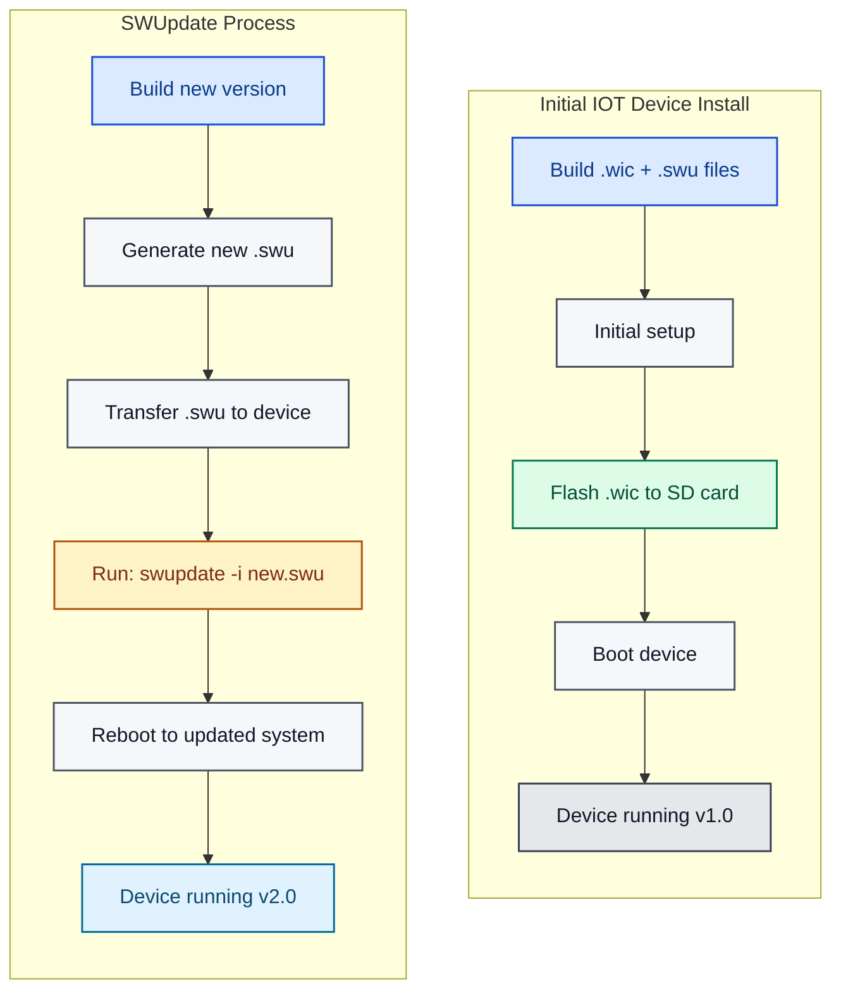

# DGAM PR IOT2050 Custom Image

This project extends the Siemens IOT2050 platform with custom functionality for Kubernetes deployment. It builds upon the [meta-iot2050](https://github.com/siemens/meta-iot2050) layer using the ISAR build system (Debian-based embedded Linux).

## Table of Contents

- [Project Overview](#project-overview)
- [Architecture](#architecture)
- [Building](#building)
- [Deployment](#deployment)
- [SWUpdate Usage](#swupdate-usage)
- [KubeSolo Configuration](#kubesolo-configuration)
- [Advanced Topics](#advanced-topics)
- [Troubleshooting](#troubleshooting)

---

## Project Overview

### Project Structure

```
.
├── kas/
│   ├── plc-facing-dgam-pr.yml   # PLC-facing device configuration
│   └── vpn-facing-dgam-pr.yml   # VPN-facing device configuration (with Kubernetes)
├── meta-dgam-pr/                # Custom Yocto/ISAR layer
│   ├── conf/
│   │   └── layer.conf          # Layer configuration
│   └── recipes-app/
│       ├── kubectl/            # Kubernetes CLI tool
│       └── kubesolo/           # Single-node Kubernetes setup
└── meta-iot2050/               # Siemens IOT2050 base layer (submodule/checkout)
```

### Device Types

This repository supports two IOT2050 device configurations based on the [DGAM PR rack architecture](https://github.com/DGAM-PR/architecture/tree/main/rack):

#### PLC-Facing Device (IOT1)
- **Purpose**: Direct PLC connectivity for data acquisition
- **Configuration**: [`kas/plc-facing-dgam-pr.yml`](kas/plc-facing-dgam-pr.yml)
- **Features**: Standard IOT2050 SWUpdate image without Kubernetes
- **Build command**: `./kas-container --isar build kas/plc-facing-dgam-pr.yml`

#### VPN-Facing Device (IOT2)
- **Purpose**: Edge computing node accessible via VPN
- **Configuration**: [`kas/vpn-facing-dgam-pr.yml`](kas/vpn-facing-dgam-pr.yml)
- **Features**: Kubernetes-enabled with KubeSolo and kubectl
- **Build command**: `./kas-container --isar build kas/vpn-facing-dgam-pr.yml`

**Key Differences**:
- PLC-facing: Minimal configuration, focuses on PLC communication
- VPN-facing: Includes container orchestration (KubeSolo), remote management capabilities, hardened security settings

For complete rack architecture and device placement, see the [DGAM PR Architecture Repository](https://github.com/DGAM-PR/architecture/tree/main/rack).

### Custom Features

This build adds:
- ✅ **kubesolo**: Single-node Kubernetes distribution
- ✅ **kubectl**: Kubernetes CLI tool (v1.34.0)

And removes to optimize for Kubernetes:
- ❌ **Node-RED** (disabled)
- ❌ **Docker** (disabled, using KubeSolo instead)
- ❌ **Mosquitto** MQTT broker (removed)

### Security Hardening

Both PLC-facing and VPN-facing configurations include security hardening measures:

#### TCF Agent Removal

**What is TCF Agent?**
- Target Communication Framework (TCF) Agent is a debugging and development tool
- Provides remote access to device internals for development/debugging
- Opens network ports for remote connections

**Why we remove it:**
- ✅ **Reduces attack surface** - Eliminates unnecessary network services on production devices
- ✅ **Closes debugging ports** - Prevents unauthorized remote access via TCF protocol
- ✅ **Production hardening** - Development tools should not run on deployed systems
- ✅ **Compliance** - Aligns with security best practices for industrial IoT deployments

**Implementation:**
```yaml
IMAGE_INSTALL:remove = "tcf-agent"
```

This removal is configured in both [`kas/plc-facing-dgam-pr.yml`](kas/plc-facing-dgam-pr.yml) and [`kas/vpn-facing-dgam-pr.yml`](kas/vpn-facing-dgam-pr.yml).

### Prerequisites

- Docker or Podman
- ~50GB free disk space
- Linux host (Ubuntu/Debian recommended)

---

## Architecture

### Update Workflow



### KAS Configuration Chain

Both configurations use a layered include approach:

```
kas/[plc|vpn]-facing-dgam-pr.yml
  └─ meta-iot2050/kas-iot2050-swupdate.yml
      └─ meta-iot2050/kas-iot2050-example.yml
          ├─ meta-iot2050/kas/iot2050.yml (base ISAR config)
          ├─ meta-iot2050/kas/opt/example.yml
          ├─ meta-iot2050/kas/opt/node-red.yml
          └─ meta-iot2050/kas/opt/sm.yml
```

### Active Layers

Both builds include these Yocto/ISAR layers:

1. **isar/meta** - ISAR core (Debian build system)
2. **cip-core** - Civil Infrastructure Platform packages
3. **meta-iot2050/meta** - IOT2050 hardware support
4. **meta-iot2050/meta-example** - Example applications
5. **meta-iot2050/meta-node-red** - Node-RED (disabled in VPN-facing config)
6. **meta-iot2050/meta-sm** - SM variant support
7. **meta-dgam-pr** - Custom DGAM PR packages

### Configuration Overrides

The VPN-facing configuration ([`kas/vpn-facing-dgam-pr.yml`](kas/vpn-facing-dgam-pr.yml)) includes additional customizations:

```yaml
IOT2050_NODE_RED_SUPPORT = "0"           # Disable Node-RED
IOT2050_DOCKER_SUPPORT = "0"             # Disable Docker
IMAGE_INSTALL:append = " kubesolo"       # Add kubesolo package
IMAGE_INSTALL:append = " kubectl"        # Add kubectl package
INITRAMFS_OVERLAY_MOUNT_OPTION = "defaults,nodev,nosuid"  # Hardened mounts
```

The PLC-facing configuration ([`kas/plc-facing-dgam-pr.yml`](kas/plc-facing-dgam-pr.yml)) uses default SWU meta-iot2050 settings without these overrides.

### Layer Compatibility

The `meta-dgam-pr` layer declares:

- **Layer dependencies**: `core` (ISAR), `meta` (IOT2050)
- **Series compatibility**: `next` (ISAR series naming)

⚠️ **Note**: ISAR uses different series names than Yocto (e.g., `next` vs `scarthgap`).

### Build System: ISAR vs Yocto

This project uses **ISAR** (Integration System for Automated Root filesystem generation), not standard Yocto:

| Aspect | ISAR | Yocto/OpenEmbedded |
|--------|------|-------------------|
| Base | Debian packages | Custom built packages |
| Build time | Faster | Slower |
| Package format | .deb | .rpm, .ipk, .deb |
| Toolchain | Debian toolchain | Custom cross-compiler |
| Series naming | `next`, `v0.6` | `scarthgap`, `kirkstone` |

---

## Building

### Quick Start

Choose the appropriate configuration for your device type:

```bash
# Build PLC-facing device (standard IOT2050)
./kas-container --isar build kas/plc-facing-dgam-pr.yml

# Build VPN-facing device (with Kubernetes)
./kas-container --isar build kas/vpn-facing-dgam-pr.yml
```

⚠️ The `--isar` flag is **required** because the IOT2050 platform uses ISAR rather than standard Yocto/OpenEmbedded.

### Build Options

Replace `<config-file>` with either `kas/plc-facing-dgam-pr.yml` or `kas/vpn-facing-dgam-pr.yml`:

```bash
# Clean build artifacts (keep downloads)
./kas-container --isar clean <config-file>

# Complete clean including downloads
./kas-container --isar cleanall <config-file>

# Open shell in build environment
./kas-container --isar shell <config-file>
```

### Complete Cleanup Script

For a complete cleanup including fetched repositories (isar, meta-iot2050, cip-core), use the provided cleanup script:

```bash
# Interactive cleanup (asks for confirmation)
./clean-build-deps.sh

# Force cleanup (no confirmation)
./clean-build-deps.sh --force
```

This script removes:
- `build/` - All build artifacts and output images
- `isar/` - ISAR build system repository
- `meta-iot2050/` - IOT2050 layer repository
- `cip-core/` - CIP core layer repository

These will be automatically re-downloaded on the next build. Useful for starting completely fresh or resolving repository conflicts.

### Build Output

Location of build results:

```
build/
├── tmp/
│   ├── deploy/
│   │   └── images/
│   │       └── iot2050/
│   │           ├── iot2050-image-swu-example-iot2050-debian-iot2050.wic     ← Initial installation image
│   │           ├── iot2050-image-swu-example-iot2050-debian-iot2050.swu     ← Update package
│   │           ├── iot2050-image-swu-example-iot2050-debian-iot2050.wic.bmap← Block map for bmaptool
│   │           └── iot2050-image-swu-example-iot2050-debian-iot2050.wic.img ← Symlink to .wic
│   └── work/     ← Intermediate build files
└── sources/      ← Downloaded source repositories
```

### File Types

| Extension | Purpose | When to Use |
|-----------|---------|-------------|
| `.wic` | Bootable disk image | Initial installation |
| `.swu` | Update package | System updates |

### Copy Files from Build Server

Example using SCP to transfer build artifacts:

```bash
# Create directory on destination machine
mkdir ~/images

# Copy both .wic and .swu files from build server
scp <username>@<buildserver>:repos/dgam-pr-iot2050/build/tmp/deploy/images/iot2050/iot2050-image-swu-example-iot2050-debian-iot2050.{wic,swu} ~/images/
```

---

## Deployment

### Initial Installation

#### Method 1: Flash eMMC from Service Stick (Recommended)

1. **Prepare USB stick** with .wic file
2. **Boot IOT2050** from Siemens service stick (Industrial OS)
   - Default credentials: `root/root`
3. **Mount USB stick**:
   ```bash
   sudo mkdir -p /tmp/usb
   sudo mount -t ext4 /dev/sda1 /tmp/usb
   cd /tmp/usb
   ```
4. **Flash to eMMC** (this takes several minutes):
   ```bash
   sudo dd if=./iot2050-image-swu-example-iot2050-debian-iot2050.wic \
           of=/dev/mmcblk1 \
           bs=4M \
           status=progress \
           conv=fsync
   ```
5. **Reboot**: `sudo reboot`

#### Method 2: Direct SD Card Flash

```bash
# Flash .wic to SD card on your PC
sudo dd if=build/tmp/deploy/images/iot2050/iot2050-image-swu-example-iot2050-debian-iot2050.wic \
        of=/dev/mmcblk0 \
        bs=4M \
        oflag=sync \
        status=progress

# Or use Balena Etcher (GUI tool)
```

---

## SWUpdate Usage

### How SWUpdate Works

The system uses a dual-partition layout:

```
┌─────────────────────────────────────┐
│ Boot Partition                      │
├─────────────────────────────────────┤
│ Root Filesystem A (Active)          │ ← Currently running
├─────────────────────────────────────┤
│ Root Filesystem B (Inactive)        │ ← Update target
└─────────────────────────────────────┘
```

**Update process**:
1. `swupdate` writes to the inactive partition
2. Bootloader switches to updated partition on reboot
3. Previous partition becomes backup for rollback

### Applying Updates

#### Method 1: Network Transfer (Recommended)

```bash
# Transfer update file to device
scp build/tmp/deploy/images/iot2050/iot2050-image-swu-example-iot2050-debian-iot2050.swu \
    root@192.168.200.1:/tmp/

# SSH into device
ssh root@192.168.200.1

# Apply update
swupdate -i /tmp/iot2050-image-swu-example-iot2050-debian-iot2050.swu

# Reboot to activate new system
reboot
```

#### Method 2: USB Stick

```bash
# Copy .swu file to USB stick
# Insert USB into IOT2050

mount /dev/sda1 /mnt
swupdate -i /mnt/iot2050-image-swu-example-iot2050-debian-iot2050.swu
reboot
```

#### Method 3: Direct Download

```bash
# On the IOT2050 device
wget https://your-update-server.com/updates/latest.swu -O /tmp/update.swu
swupdate -i /tmp/update.swu
reboot
```

### Confirming Updates

⚠️ **Important**: After rebooting into the updated system, you must confirm the update:

```bash
# Test that the system works correctly
# Then confirm the update to make it permanent
complete_update.sh
```

**Warning**: If you don't run `complete_update.sh`, the next reboot will roll back to the previous version!

### Rollback Protection

If an update fails:
- **Automatic**: Device boots back to previous working version
- **Manual**: Reboot without running `complete_update.sh`

---

## KubeSolo Configuration

### Filesystem Security and Overlay Mounts

The IOT2050 uses a read-only root filesystem with writable overlay directories for data persistence. For security hardening, overlay mount options are configured in the build (see [Configuration Overrides](#configuration-overrides)):

```yaml
INITRAMFS_OVERLAY_MOUNT_OPTION = "defaults,nodev,nosuid"
```

**What this does**:
- `defaults` - Standard mount options (rw, suid, dev, exec, auto, nouser, async)
- `nodev` - **Prevents device files from being interpreted** - blocks potential privilege escalation via special device files
- `nosuid` - **Ignores setuid/setgid bits** - prevents privilege escalation via setuid binaries on writable partitions

**Why this matters for KubeSolo**:
- KubeSolo writes to `/var/lib/kubesolo` and `/var/log`
- These directories are on writable overlay partitions by a mounted /var partition, the same one being used by both OS partitions.
- Without `nodev` and `nosuid`, an attacker could place malicious device files or setuid binaries in these writable locations
- This hardening prevents such attacks while allowing normal KubeSolo operations

**KubeSolo directory structure**:
- `/usr/bin/kubesolo` - Binary on read-only root (executable, protected)
- `/var/lib/kubesolo` - Cluster data, certificates, configs (writable, hardened)
- `/var/log` - Log files (writable, hardened)

⚠️ **Note**: These security restrictions do not affect normal container operations but significantly reduce the attack surface.

### Systemd Service

The kubesolo service is automatically installed but requires per-device configuration.

#### Service Configuration

- **Configuration file**: `/var/lib/kubesolo/config`
- **Service file**: `/usr/lib/systemd/system/kubesolo.service`
- **Validation script**: `/usr/bin/kubesolo-prestart.sh`
- **KUBECONFIG**: Set to `/var/lib/kubesolo/pki/admin/admin.kubeconfig`

#### Automatic Retry Behavior

If configuration is missing or invalid:
1. ✅ Service retries every **60 seconds**
2. ⚠️ After **5 failed attempts** in a **10-minute window**, systemd stops retrying
3. 🛑 Service remains in failed state until configuration is provided or device reboots

#### Per-Device Setup

After deploying the OS image to each IOT2050 device:

```bash
# Edit the configuration file
vi /var/lib/kubesolo/config

# Uncomment and set your device-specific values:
KUBESOLO_PORTAINER_EDGE_ID=device-001
KUBESOLO_PORTAINER_EDGE_KEY=YmFzZTY0ZW5jb2RlZGtleQ==

# Start the service
systemctl start kubesolo

# Check status
systemctl status kubesolo
```

#### Troubleshooting KubeSolo

```bash
# View service logs
journalctl -u kubesolo -f

# Check service status
systemctl status kubesolo

# Manually restart after configuration
systemctl restart kubesolo

# Reset failure counter (if service hit restart limit)
systemctl reset-failed kubesolo
```

---

## Advanced Topics

### Inspecting Images Locally

Mount your image locally to inspect contents:

```bash
# 1. Mount the image
sudo losetup -fP iot2050-image-swu-example-iot2050-debian-iot2050.wic

# 2. Check what loop device was added (probably loop0)
lsblk

# 3. Create mount directory
mkdir -p /mnt/yourimage

# 4. Mount the partition (p2 is usually the root filesystem)
sudo mount /dev/loop0p2 /mnt/yourimage

# 5. Your image is now mounted at /mnt/yourimage
cd /mnt/yourimage

# 6. Cleanup when done
sudo umount /dev/loop0p2
sudo losetup -d /dev/loop0
```

### U-Boot Information

U-Boot is the bootloader used by IOT2050 for hardware initialization and OS loading.

**Resources**:
- [IOT2050 U-Boot Documentation](https://docs.u-boot.org/en/latest/board/siemens/iot2050.html)
- [U-Boot General Documentation](https://docs.u-boot.org/en/latest/)
- Local: [`meta-iot2050/meta/recipes-bsp/u-boot/README.md`](meta-iot2050/meta/recipes-bsp/u-boot/README.md)

**Common U-Boot commands**:

```bash
# Boot from USB (when in U-Boot prompt)
setenv devnum 0
run bootcmd_usb0

# Mount specific partition
load mmc 0:2 ${kernel_addr_r} linux.efi
bootefi ${kernel_addr_r} ${fdtcontroladdr}
```

### Firmware Updates

For detailed firmware update procedures, including U-Boot and bootloader updates, see the official Siemens documentation:

**Downloads**: [IOT2050 Firmware & Tools](https://support.industry.siemens.com/cs/document/109741799/downloads-for-simatic-iot20x0?dti=0&lc=en-WW)

## IOT2050 Firmware Update – Short Procedure

Everything to download can be found here:
https://support.industry.siemens.com/cs/document/109741799/downloads-for-simatic-iot20x0?dti=0&lc=en-WW

#### Prerequisites

- Service stick / example image for IOT2050
- Firmware update files from Siemens or from KAS build/tmp/deploy/iot2050/ directory:
  - `iot2050-firmware-update_<version>_arm64.deb`
  - `IOT2050-FW-Update-PKG-V01.xx.xx-<hash>.tar.xz`
- Network access to a Debian mirror (for `apt`)

---

### 1. Prepare Files on the IOT2050

On your PC, download the firmware update tool and package from Siemens, then copy them to a USB Stick:

- A USB Stick only containing these files, not the same stick as the USB Stick you use to install service-stick siemens Industrial OS to eMMC.
- Make sure to copy both the .deb and the .tar.xz from either your siemens download or your KAS build/tmp/deploy/iot2050/ directory (this one is preferred as it fits the image you will eventually run)
  - Use the following standard example build to get the latest firmware files: `./kas-container build ./kas-iot2050-example.yml`

---

### 2. Boot Service Stick and Install OS to eMMC

1. Boot the IOT2050 from the **service stick/example image**.
  0. Insert USB Stick
  1. Interrupt the boot process to get into u-boot upon starting the device
  2. following commands
    1. `setenv devnum 0` <- bootcmd_usb0=devnum=0; run usb_boot
    2. `run bootcmd_usb0` <- usb_boot=usb start; if usb dev ${devnum}; then devtype=usb; run scan_dev_for_boot_part; fi
2. Use the menu to **install the OS to eMMC** (Advanced PG2).
  1. `Important:` Make sure to install an APT Mirror and also select the development packages!!!
3. Reboot so the device runs from the freshly installed OS on eMMC.

---

### 3. Configure Debian Mirror and Install Dependencies

1. Configure `/etc/apt/sources.list` with a valid Debian mirror (as per Siemens example image/service stick).
2. Update package lists and install required packages:

```bash
apt update # Loads all the info (Do NOT apt Upgrade!)
apt install python3-progress
```

(Install additional dev / Python packages if required by your environment.)

---

### 4. Ensure `/etc/os-release` Contains Required Keys

Sometimes the BUILD_ID is missing, and the firmware update requires BUILD_ID derrived from /etc/os-release

> Note: The Siemens update script reads `BUILD_ID` (and possibly other keys) from `/etc/os-release`. Missing keys will cause a Python `KeyError`.

0. Inspect `/etc/os-release`:

```bash
cat /etc/os-release
```

If that file does not contain BUILD_ID, add it as follows below, else ignore the steps.

1. Check current firmware information (depending on image):

```bash
fw_printenv fw_version
# Example output: fw_version=2025.04-V01.05.01-80-gfe007f1
```

2. Export the trimmed variable

```bash
CURRENT_VER=$(fw_printenv fw_version | cut -d'-' -f2)
```

3. Add to /etc/os-release

```bash
echo "BUILD_ID=$CURRENT_VER" >> /etc/os-release
```

The file /etc/os-release should now hold the current firmware version in the form of BUILD_ID

---

### 5. Install Firmware Update Tool

```bash
#Insert USB Stick that has the latest firmware files, mount it and copy it to ~
mkdir /tmp/usb
sudo mount /dev/sda1 /tmp/usb #could be sdb1 if you have both usb sticks plugged in
cp -R /tmp/usb/firmware ./
cd ~/firmware

# Remove any old version
dpkg -r iot2050-firmware-update || true

# Install new tool
dpkg -i firmware-update-package_0.1.arm64.deb # (or similar)
apt -f install
```
- Possible also do `apt install python3-packages`, however it should be installed after `apt -f`

---

### 6. Run Firmware Update

From `~/firmware/`

```bash
iot2050-firmware-update IOT2050-FW-Update-PKG-<Your Version>.tar.xz
```

During the process:

1. Confirm the warning that the device may become unbootable (`Y`).
2. When prompted, choose whether to:
   - keep the current boot order (`Y`), or
   - reset to defaults (`n`), according to your setup / Siemens guidance.
3. Allow the device to reboot when the tool finishes.

---

### 7. Verify Firmware Version

After reboot:

```bash
fw_printenv fw_version
```

Confirm that the reported firmware version matches the firmware package you installed.

---

## Troubleshooting

### Container Version Issues

If you encounter missing tools (`reprepro`, `envsubst`, `quilt`), ensure you're using kas-isar 5.1+:

```bash
# Check current images
docker images | grep kas

# Pull latest version
docker pull ghcr.io/siemens/kas/kas-isar:5.1
```

### Layer Dependency Errors

Ensure [`meta-dgam-pr/conf/layer.conf`](meta-dgam-pr/conf/layer.conf) uses:
- `LAYERDEPENDS_meta-dgam-pr = "core meta"` (not `iot2050`)
- `LAYERSERIES_COMPAT_meta-dgam-pr = "next"` (not Yocto series like `scarthgap`)

### Build Errors

```bash
# Clean and rebuild
./kas-container --isar cleanall kas/dgam-pr.yml
./kas-container --isar build kas/dgam-pr.yml

# Check build logs
less build/tmp/work/*/temp/log.do_*
```

### Update Won't Apply

- Verify `.swu` file is not corrupted
- Check disk space: `df -h`
- Review swupdate logs: `journalctl -u swupdate`
- Ensure correct partition layout: `lsblk`

### Device Won't Boot After Update

- Remove power and reinsert - device should boot previous version
- If still failing, reflash using `.wic` file from USB/SD card

---

## References

- [meta-iot2050 Documentation](https://github.com/siemens/meta-iot2050)
- [KAS Documentation](https://kas.readthedocs.io/)
- [ISAR Documentation](https://github.com/ilbers/isar)
- [IOT2050 Product Page](https://new.siemens.com/global/en/products/automation/pc-based/iot-gateways/simatic-iot2050.html)
- [IOT2050 Downloads](https://support.industry.siemens.com/cs/document/109741799/)

---

## License

See [LICENCE](LICENCE) file for details.
