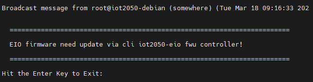

# EIO Firmware & Binaries — Pre-Build Download Required

The `iot2050-eiofsd` recipe requires proprietary Siemens EIO firmware and
binaries that **cannot be distributed in this repository**. You must download
them manually from Siemens Industry Online Support (SIOS) before building the
VPN-facing image for the **IOT2050 Advanced SM** variant.

## EIO controller firmware update
If the STAT LED of your device remains orange and you receive the following brodcast message an EIO controller firmware update is necessary.



Action
1.	Open a valid serial connection and log in as root.
2.	Use the command iot2050-eio fwu controller to perform an eio firmware update.

https://github.com/SIMATICmeetsLinux/IOT2050-Setting-Up-Example-Image

## Why this directory exists

`meta-iot2050` is a kas-managed checkout and is wiped on every fresh build
environment. Storing the binaries here (inside `meta-dgam-pr`, which is your
own persistent repo) means you only need to download them **once per build
machine**.

The `iot2050-eiofsd_%.bbappend` in this directory redirects BitBake's file
search path so the recipe picks up the binaries from here instead of from
`meta-sm/recipes-app/iot2050-eiofsd/files/bin/`.

## Download instructions

1. Go to the Siemens Industry Online Support downloads page:
   <https://support.industry.siemens.com/cs/document/109741799/>

2. Find and download the **EIO firmware & binaries** package for the IOT2050.

3. Extract the archive contents into:
   ```
   meta-dgam-pr/recipes-app/iot2050-eiofsd/files/bin/
   ```

4. Verify the directory is not empty before building:
   ```bash
   ls meta-dgam-pr/recipes-app/iot2050-eiofsd/files/bin/
   ```

5. Build the VPN-facing image:
   ```bash
   ./kas-container --isar build kas/vpn-facing-dgam-pr.yml
   ```

## Notes

- The `files/bin/` directory is excluded from git via `.gitignore` in this
  directory. Only the `.gitkeep` placeholder is tracked.
- These binaries are required **only** for the IOT2050 Advanced SM variant.
  The same image runs on standard Advanced hardware without issue — the SM
  device tree and EIO daemon are simply unused on non-SM boards.